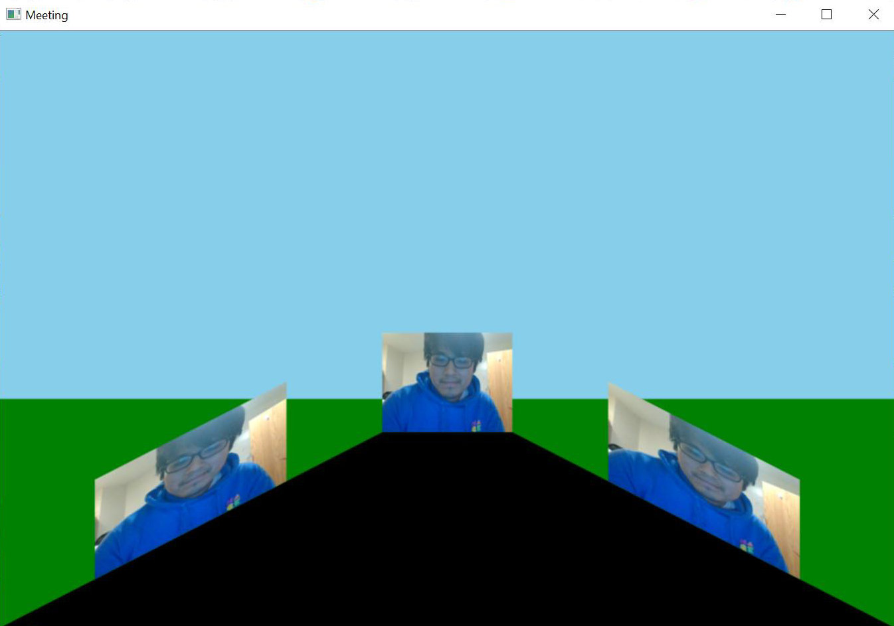

# video_perspective

A way of giving more dimension to our video meetings. 

(Ideally we would want the three video cameras to be from different people)

## Installation 
- `python -m venv env`
- `source env/Scripts/activate` (Windows) or `source env/bin/activate` (Mac/Linux)
- `pip install -r requirement.txt`

## Use
- `python video_perspective.py`

